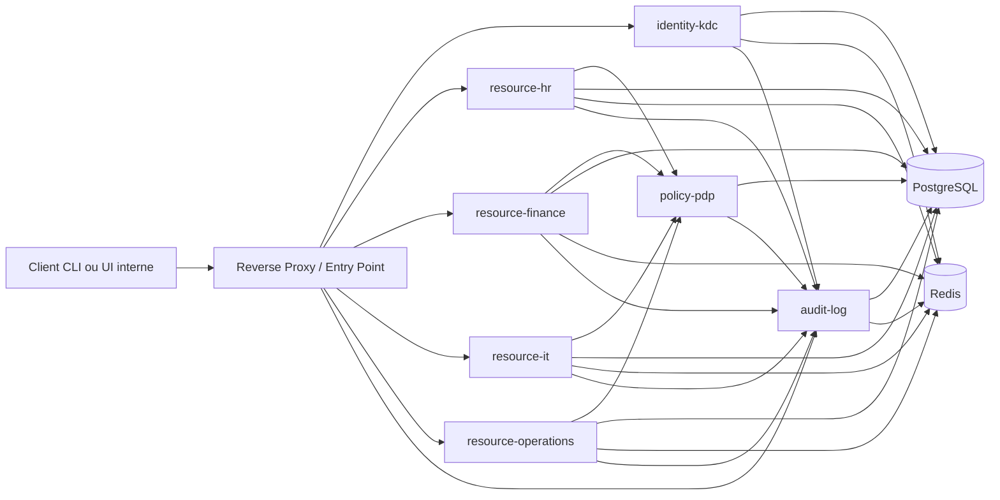
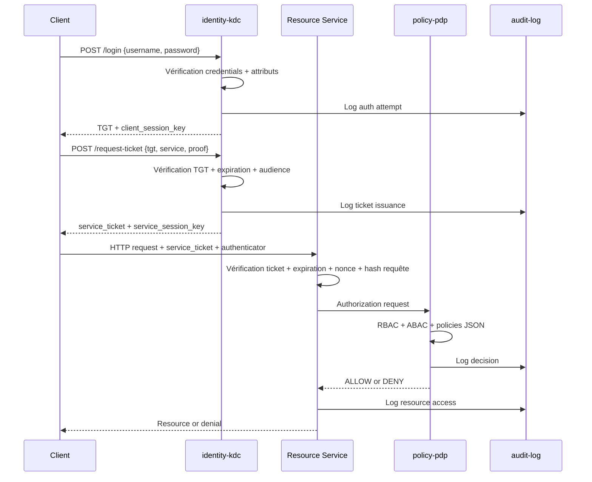

# SecureCorp Zero-Trust Access Control System

## 1. Vision du projet

L'objectif est de construire une plateforme distribuée moderne, conteneurisée et démontrable, capable de simuler un système de contrôle d'accès Zero Trust pour SecureCorp.

Le système doit couvrir quatre axes majeurs:

1. authentification inspirée de Kerberos
2. autorisation hybride RBAC + ABAC
3. moteur de politiques externe et explicable
4. comparaison entre une instance volontairement vulnérable et une instance durcie

Le livrable cible n'est pas un simple ensemble d'APIs. C'est une plateforme cohérente qui montre:

- une architecture microservices propre
- une implémentation sécurité explicite et compréhensible
- des mécanismes de défense observables
- des scénarios d'attaque reproductibles
- un code maintenable et démontrable dans Docker

## 2. Choix d'architecture

### 2.1 Direction technique retenue

Je recommande un monorepo microservices en Node.js avec NestJS et Nx.

Pourquoi NestJS + Nx:

- NestJS impose une structure modulaire claire, très adaptée aux principes SOLID
- Nx accélère le bootstrap du monorepo, le partage de bibliothèques internes et l'exécution ciblée
- TypeScript permet de définir proprement les contrats entre services et les objets de sécurité
- l'écosystème Node permet d'aller vite sur les APIs, la configuration, les tests et l'outillage Docker
- pour ce sujet, la vitesse de livraison et la maintenabilité priment sur l'optimisation bas niveau

### 2.2 Règle de conception importante

Les mécanismes de sécurité critiques ne doivent pas dépendre de bibliothèques d'authentification toutes faites.

Doivent être implémentés en interne avec primitives standard:

- génération des tickets
- chiffrement et signature des tickets
- authenticators HTTP
- validation d'expiration
- protection anti-replay
- hiérarchie RBAC
- évaluation ABAC
- moteur PDP JSON

Les dépendances externes, si nécessaires, doivent rester purement infrastructurelles ou framework:

- NestJS et son runtime HTTP
- driver PostgreSQL
- client Redis
- outils de validation, tests et build

Ne doivent pas être délégués à une lib métier opaque:

- logique de tickets Kerberos-like
- signature et vérification des payloads de sécurité
- replay protection
- moteur RBAC/ABAC
- moteur PDP JSON

## 3. Vue d'ensemble de la solution

### 3.1 Services principaux

Le système sera composé des services suivants:

1. `identity-kdc`
   Rôle: Authentication Server + Ticket Granting Service.

2. `policy-pdp`
   Rôle: moteur de décision d'autorisation fondé sur RBAC, ABAC et politiques JSON.

3. `resource-hr`
   Rôle: serveur de ressources RH.

4. `resource-finance`
   Rôle: serveur de ressources Finance.

5. `resource-it`
   Rôle: serveur de ressources IT.

6. `resource-operations`
   Rôle: serveur de ressources Operations.

7. `audit-log`
   Rôle: collecte, agrégation et consultation des événements de sécurité.

8. `admin-console` optionnel
   Rôle: interface interne de visualisation des policies, tickets simulés, logs et attaques.

### 3.2 Services d'infrastructure

1. `postgres`
   Stockage persistant des utilisateurs, rôles, ressources, policies et logs.

2. `redis`
   Stockage des nonces, cache anti-replay, sessions techniques et limitation temporelle.

3. `reverse-proxy`
   Point d'entrée local de démonstration, routage par service, terminaison TLS locale si désirée.

## 4. Diagramme d'architecture globale



## 5. Modèle Zero Trust

Le système doit appliquer ces règles partout:

1. aucun service ne fait confiance au réseau seul
2. chaque appel porte une preuve cryptographique
3. chaque requête est réévaluée côté autorisation
4. la possession d'un ticket ne suffit jamais sans authenticator valide
5. le rôle ne suffit jamais sans attributs et contexte
6. chaque décision est journalisée

## 6. Flux d'authentification Kerberos-like sur HTTP

### 6.1 Principes

On s'inspire de Kerberos, mais le transport applicatif est HTTP/JSON.

Le flux est découpé en trois objets:

1. `TGT` pour obtenir des tickets de service
2. `Service Ticket` ciblé pour un microservice précis
3. `Authenticator` éphémère joint à chaque requête métier

### 6.2 Séquence complète



### 6.3 Structure des tickets

#### TGT

```json
{
  "typ": "TGT",
  "sub": "user-123",
  "username": "alice",
  "role": "manager",
  "department": "finance",
  "clearance": "secret",
  "location": "internal",
  "issued_at": "2026-04-18T09:00:00Z",
  "expires_at": "2026-04-18T09:15:00Z",
  "nonce": "uuid",
  "tgs_audience": "identity-kdc",
  "session_key": "base64"
}
```

#### Service Ticket

```json
{
  "typ": "ST",
  "sub": "user-123",
  "service": "resource-finance",
  "role": "manager",
  "department": "finance",
  "clearance": "secret",
  "location": "internal",
  "issued_at": "2026-04-18T09:01:00Z",
  "expires_at": "2026-04-18T09:06:00Z",
  "nonce": "uuid",
  "session_key": "base64",
  "scopes": ["read", "write"]
}
```

#### Authenticator

```json
{
  "sub": "user-123",
  "service": "resource-finance",
  "timestamp": "2026-04-18T09:01:10Z",
  "nonce": "uuid",
  "request_hash": "sha256(method:path:body)"
}
```

### 6.4 Protection cryptographique recommandée

1. `AES-256-GCM` pour le chiffrement authentifié des tickets
2. `HMAC-SHA256` pour sceller les structures si nécessaire
3. rotation des clés maître KDC par version `kid`
4. nonces uniques stockés dans Redis avec TTL
5. `request_hash` pour lier l'authenticator à la requête réelle

### 6.5 En-têtes HTTP proposés

```text
X-Service-Ticket: <base64-ticket>
X-Authenticator: <base64-authenticator>
X-Key-Id: <kid>
X-Request-Id: <uuid>
```

## 7. Modèle d'autorisation

### 7.1 RBAC

Rôles de base:

- `employee`
- `manager`
- `admin`

Permissions de base:

- `employee`: `read`
- `manager`: `read`, `write`
- `admin`: `read`, `write`, `delete`

Hiérarchie:

- `admin` hérite de `manager`
- `manager` hérite de `employee`

Séparation of Duties:

- un utilisateur ne peut pas cumuler certaines fonctions critiques
- exemple: `finance-approver` et `finance-auditor` incompatibles

### 7.2 ABAC

#### Attributs utilisateur

- `department`
- `role`
- `clearance`
- `location`
- `employment_status`

#### Attributs ressource

- `resource.department`
- `resource.classification`
- `resource.owner`
- `resource.allowed_actions`

#### Attributs environnement

- `request.time`
- `request.ip`
- `request.network_zone`
- `request.method`

### 7.3 Politique de décision

Le PDP doit utiliser un algorithme `deny-overrides`.

Ordre recommandé:

1. validation technique minimale
2. règles de séparation des devoirs
3. règles RBAC
4. règles ABAC
5. politiques JSON externes
6. décision finale + justification

### 7.4 Format de réponse PDP

```json
{
  "decision": "DENY",
  "reason": "resource classification exceeds user clearance",
  "matched_policies": ["deny-secret-external", "require-clearance-secret"],
  "obligations": ["log-security-event"],
  "context": {
    "request_id": "uuid",
    "subject": "user-123",
    "resource": "finance-doc-77"
  }
}
```

## 8. Policy engine JSON

### 8.1 Structure proposée

```json
{
  "id": "deny-secret-external",
  "description": "Deny access to secret resources from external locations",
  "effect": "deny",
  "priority": 100,
  "target": {
    "service": "*",
    "action": "*"
  },
  "conditions": [
    {
      "field": "resource.classification",
      "operator": "eq",
      "value": "secret"
    },
    {
      "field": "user.location",
      "operator": "eq",
      "value": "external"
    }
  ]
}
```

### 8.2 Exemples de politiques à fournir

1. isolation départementale
2. restriction `secret` selon clearance
3. interdiction d'accès externe aux ressources critiques
4. fenêtre horaire `08:00-18:00`
5. restriction d'actions d'écriture pour `employee`
6. interdiction de suppression hors `admin`

## 9. Services métiers de ressources

Chaque resource service expose les endpoints du sujet:

- `GET /resource/:id`
- `POST /resource`
- `DELETE /resource/:id`

Chaque service contient:

1. middleware de validation du ticket
2. middleware de validation de l'authenticator
3. `PEP` local qui appelle le PDP
4. couche métier propre au domaine
5. couche de persistance isolée
6. audit structuré systématique

### 9.1 Répartition des domaines

#### `resource-hr`

- dossiers RH
- statuts employés
- documents sensibles du personnel

#### `resource-finance`

- budgets
- factures
- écritures financières

#### `resource-it`

- inventaire technique
- incidents internes
- configurations internes

#### `resource-operations`

- plannings
- opérations terrain
- données d'exécution

## 10. Design des APIs

### 10.1 Authentication API

#### `POST /login`

Entrée:

```json
{
  "username": "alice",
  "password": "P@ssw0rd!"
}
```

Sortie:

```json
{
  "tgt": "base64",
  "client_session_key": "base64",
  "expires_at": "2026-04-18T09:15:00Z",
  "user": {
    "id": "user-123",
    "role": "manager",
    "department": "finance",
    "clearance": "secret"
  }
}
```

#### `POST /request-ticket`

Entrée:

```json
{
  "tgt": "base64",
  "service": "resource-finance"
}
```

Sortie:

```json
{
  "service_ticket": "base64",
  "service_session_key": "base64",
  "service": "resource-finance",
  "expires_at": "2026-04-18T09:06:00Z"
}
```

### 10.2 PDP API

#### `POST /authorize`

Entrée:

```json
{
  "subject": {
    "id": "user-123",
    "role": "manager",
    "department": "finance",
    "clearance": "secret",
    "location": "internal"
  },
  "action": "read",
  "resource": {
    "id": "finance-doc-77",
    "department": "finance",
    "classification": "secret"
  },
  "environment": {
    "time": "09:30",
    "ip": "10.0.0.8",
    "network_zone": "internal"
  }
}
```

### 10.3 Audit API

#### `POST /events`

Transport d'événements structurés:

```json
{
  "timestamp": "2026-04-18T09:01:10Z",
  "event_type": "authorization.decision",
  "request_id": "uuid",
  "severity": "info",
  "service": "resource-finance",
  "actor": "user-123",
  "details": {
    "decision": "ALLOW",
    "resource": "finance-doc-77"
  }
}
```

## 11. Instance sécurisée vs instance vulnérable

Le projet doit livrer deux environnements séparés mais comparables.

### 11.1 Objectif pédagogique

L'instance vulnérable sert à démontrer les attaques.

L'instance sécurisée sert à montrer les mitigations et la différence de posture.

### 11.2 Règle d'implémentation recommandée

Conserver un seul codebase, mais introduire une stratégie de sécurité injectable:

- `SECURITY_PROFILE=vulnerable`
- `SECURITY_PROFILE=secure`

Chaque contrôle critique doit avoir deux variantes.

Exemples:

1. validation expiration
2. signature ou intégrité du ticket
3. stockage anti-replay
4. contrôle `request_hash`
5. validation stricte du service cible
6. enforcement SoD

### 11.3 Comportement attendu par profil

| Contrôle | Vulnérable | Sécurisé |
|---|---|---|
| Expiration ticket | laxiste ou absente | stricte |
| Intégrité ticket | faible ou contournable | AES-GCM + HMAC + `kid` |
| Anti-replay | absent | nonce TTL + fenêtre de temps |
| Audience service | partielle | obligatoire |
| RBAC | simple rôle brut | hiérarchie + SoD |
| ABAC | incomplète | complète |
| Logging | minimal | structuré et corrélé |
| Mutuelle auth | absente | option bonus |

## 12. Attaques à démontrer

### 12.1 Replay attack

#### Vulnérabilité

Réutilisation du même `service_ticket + authenticator`.

#### Démonstration

- capturer une requête valide
- rejouer la même requête
- observer l'acceptation côté vulnérable

#### Mitigation

- nonce unique
- timestamp court
- stockage Redis des authenticators consommés
- vérification du `request_hash`

### 12.2 Ticket tampering

#### Vulnérabilité

Modification du rôle, du département ou de la durée de vie dans le ticket.

#### Démonstration

- décoder ticket vulnérable
- modifier `role=admin`
- rejouer sur ressource protégée

#### Mitigation

- chiffrement authentifié
- contrôle d'intégrité fort
- versionnement de clé

### 12.3 Privilege escalation

#### Vulnérabilité

Mauvaise séparation entre rôle affiché et permissions effectives.

#### Démonstration

- utilisateur `employee`
- accès à action `write` ou `delete`
- absence de contrôle hiérarchique ou SoD

#### Mitigation

- matrice RBAC centralisée
- héritage explicite
- vérification SoD au PDP

### 12.4 Unauthorized access

#### Vulnérabilité

Accès cross-department ou hors plage horaire.

#### Démonstration

- utilisateur finance sur ressource HR
- utilisateur externe sur ressource `secret`

#### Mitigation

- ABAC sur département, clearance, localisation, horaire
- politiques JSON `deny-overrides`

## 13. Observabilité et journalisation

Chaque service doit produire des logs JSON avec `request_id`, `ticket_id` et `actor_id`.

Événements à tracer:

1. tentative de login
2. émission de TGT
3. émission de service ticket
4. rejet d'authenticator
5. décision PDP
6. accès ressource
7. détection anti-replay
8. suspicion de tampering

Niveaux:

- `info`
- `warn`
- `error`
- `security`

## 14. Conteneurisation

### 14.1 Topologie Docker

Deux stacks séparées:

1. `compose.secure.yml`
2. `compose.vulnerable.yml`

Chaque stack doit démarrer:

- `identity-kdc`
- `policy-pdp`
- `resource-hr`
- `resource-finance`
- `resource-it`
- `resource-operations`
- `audit-log`
- `postgres`
- `redis`
- `reverse-proxy`

### 14.2 Réseaux Docker

Réseaux proposés:

- `edge_net`
- `control_net`
- `data_net`

But:

- séparer exposition publique et trafic inter-services
- rendre la démonstration plus réaliste
- limiter les communications non nécessaires

### 14.3 Secrets et configuration

Variables critiques:

- `KDC_MASTER_KEY`
- `KDC_ACTIVE_KID`
- `REDIS_URL`
- `DATABASE_URL`
- `SECURITY_PROFILE`
- `SERVICE_NAME`
- `POLICY_PATH`
- `INTERNAL_NETWORK_CIDR`

Les secrets ne doivent pas être commités. Utiliser fichiers `.env.example` et `docker compose --env-file`.

## 15. Structure de repository recommandée

```text
securecorp/
  apps/
    identity-kdc/
    policy-pdp/
    resource-hr/
    resource-finance/
    resource-it/
    resource-operations/
    audit-log/
  libs/
    shared/
      config/
      contracts/
      logging/
      utils/
    security/
      crypto/
      tickets/
      authenticators/
      replay/
      rbac/
      abac/
      policy-engine/
      security-profile/
    data/
      postgres/
      redis/
      seed/
    testing/
      fixtures/
      attack-clients/
  policies/
    secure/
    vulnerable/
  deployments/
    docker/
      compose.secure.yml
      compose.vulnerable.yml
      env/
  scripts/
    demo/
    seed/
    attacks/
  docs/
    securecorp-implementation-blueprint.md
    report-outline.md
    attack-scenarios.md
  tools/
  nx.json
  package.json
  tsconfig.base.json
```

## 16. Clean code et séparation des responsabilités

### 16.1 Couches par service

Chaque microservice NestJS doit suivre cette structure logique:

1. `transport`
2. `application`
3. `domain`
4. `infrastructure`

Traduction NestJS recommandée:

- `controllers` pour le transport HTTP
- `services` ou `use-cases` pour l'application
- `domain` pour les modèles, règles et ports
- `adapters` ou `repositories` pour l'infrastructure

### 16.2 Règles à respecter

1. pas de logique métier dans les handlers HTTP
2. pas de logique crypto dispersée dans les services métiers
3. pas d'accès DB direct depuis les middlewares
4. toutes les décisions sensibles doivent être explicables et loguées
5. toute règle sécurité doit être testable isolément

## 17. Stratégie de tests

### 17.1 Unit tests

- génération de tickets
- validation d'intégrité
- validation d'expiration
- hiérarchie RBAC
- règles ABAC
- matching des policies JSON

### 17.2 Integration tests

- login puis demande de ticket puis accès ressource
- refus cross-department
- refus hors clearance
- refus hors plage horaire
- refus delete pour non-admin

### 17.3 Security tests

- replay attack sur stack vulnérable
- replay attack bloquée sur stack secure
- tampering accepté sur stack vulnérable
- tampering bloqué sur stack secure
- escalation de privilège bloquée après correction

### 17.4 E2E demo tests

- scénario employé valide
- scénario manager valide
- scénario admin delete valide
- scénario externe interdit
- scénario département isolé

## 18. Roadmap d'implémentation

### Sprint 1

1. bootstrapping monorepo
2. configuration Docker et base infra
3. `identity-kdc` minimal
4. modèle ticket + crypto
5. login + request-ticket

### Sprint 2

1. `policy-pdp`
2. RBAC hiérarchique
3. ABAC de base
4. resource services minimum
5. audit logging

### Sprint 3

1. mode `vulnerable`
2. scénarios d'attaque
3. mode `secure`
4. anti-replay et durcissement
5. tests E2E et démo

## 19. Décisions d'architecture à figer immédiatement

Pour éviter un projet fragile, il faut verrouiller ces décisions dès le départ:

1. langage unique: TypeScript sur Node.js
2. transport: HTTP/JSON
3. framework: NestJS
4. monorepo: Nx
5. crypto: primitives Node standard uniquement pour la logique critique
6. PDP centralisé
7. PEP dans chaque resource service
8. Redis pour anti-replay
9. PostgreSQL pour persistance
10. double stack `secure` et `vulnerable`
11. monorepo avec contrats partagés minimaux

## 20. MVP recommandé

Si le temps devient contraint, le MVP démontrable doit absolument contenir:

1. `identity-kdc`
2. `policy-pdp`
3. `resource-hr`
4. `resource-finance`
5. double profil secure/vulnerable
6. replay attack
7. ticket tampering
8. RBAC + ABAC + policies JSON
9. logs structurés
10. Docker Compose complet

## 21. Extensions bonus réalistes

1. mutual authentication service-to-client
2. dashboard d'audit interne
3. rotation de clés en runtime
4. signature des événements d'audit
5. rate limiting par identité
6. simulation d'accès externe via reverse proxy séparé

## 22. Conclusion

La bonne architecture pour ce sujet n'est pas un simple CRUD sécurisé.

C'est une plateforme Zero Trust compacte, pédagogique et défendable, où:

- le KDC gère l'authentification et l'émission des tickets
- les resource services restent fins mais stricts
- le PDP centralise les décisions d'accès
- l'audit rend chaque décision traçable
- les deux stacks vulnérable et sécurisée rendent les démonstrations claires

Cette base permet ensuite d'implémenter proprement le code avec NestJS et Nx, sans improvisation structurelle.