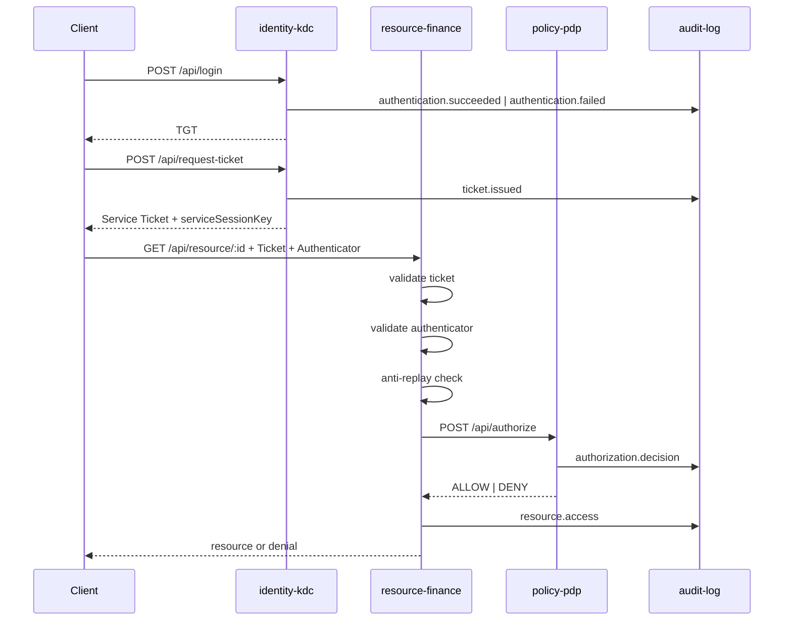

# SecureCorp Security Microservices Technical Guide

## 1. Objectif du document

Ce document décrit le fonctionnement technique des microservices de sécurité du projet SecureCorp dans l'état actuel du code.

Le but est de répondre à quatre questions:

1. quel microservice fait quoi
2. comment les services communiquent entre eux
3. quelles garanties de sécurité sont effectivement appliquées
4. quelles limites existent encore dans l'implémentation actuelle

Ce document complète l'architecture globale de [docs/securecorp-implementation-blueprint.md](docs/securecorp-implementation-blueprint.md), mais il est centré sur l'exécution technique réelle et non sur la seule vision cible.

## 2. Vue d'ensemble des microservices de sécurité

Les services les plus importants pour la sécurité sont:

1. `identity-kdc`
2. `policy-pdp`
3. `audit-log`
4. les `resource-*` en tant que `Policy Enforcement Points`

Les bibliothèques internes qui supportent ces services sont:

1. `security-crypto`
2. `security-tickets`
3. `security-authenticators`
4. `security-replay`
5. `security-rbac`
6. `security-abac`
7. `security-policy-engine`
8. `security-profile`
9. `shared-config`
10. `shared-contracts`

## 3. Rôle de chaque microservice

### 3.1 `identity-kdc`

`identity-kdc` joue le rôle de `Key Distribution Center` simplifié.

Responsabilités:

- vérifier les credentials du client
- produire un `TGT`
- accepter un `TGT` valide pour émettre un `Service Ticket`
- embarquer dans les tickets les attributs utilisateur nécessaires à l'autorisation
- auditer les événements d'authentification et d'émission de tickets

Endpoints principaux:

- `GET /api/health`
- `POST /api/login`
- `POST /api/request-ticket`

Entrées internes utilisées:

- utilisateurs seedés dans `data-seed`
- configuration runtime venant de `shared-config`
- clés maître KDC via variables d'environnement

Sorties produites:

- `TGT` chiffré
- `Service Ticket` chiffré
- `serviceSessionKey`
- événements d'audit vers `audit-log`

### 3.2 `policy-pdp`

`policy-pdp` est le `Policy Decision Point` central.

Responsabilités:

- recevoir une requête d'autorisation structurée
- appliquer RBAC
- appliquer ABAC
- charger et évaluer les policies JSON externes
- retourner une décision `ALLOW` ou `DENY`
- auditer chaque décision

Endpoints principaux:

- `GET /api/health`
- `POST /api/authorize`

Entrées internes utilisées:

- policies JSON sous `policies/secure` ou `policies/vulnerable`
- capacités de sécurité calculées par `security-profile`
- moteurs `security-rbac`, `security-abac` et `security-policy-engine`

Sorties produites:

- `AuthorizationDecision`
- événements d'audit vers `audit-log`

### 3.3 `audit-log`

`audit-log` est un microservice transversal de collecte d'événements.

Responsabilités:

- recevoir les événements de sécurité envoyés par les autres services
- les stocker en mémoire dans l'état actuel
- exposer un endpoint simple de consultation

Endpoints principaux:

- `GET /api/health`
- `POST /api/events`
- `GET /api/events?limit=N`

Limite actuelle importante:

- l'audit n'est pas persistant
- un redémarrage du service efface l'historique

### 3.4 `resource-*`

Les `resource-hr`, `resource-finance`, `resource-it` et `resource-operations` ne sont pas seulement des services métiers. Ils sont aussi les points d'application de sécurité effectifs.

Ils jouent le rôle de `PEP`, c'est-à-dire `Policy Enforcement Point`.

Responsabilités:

- recevoir la requête HTTP métier
- extraire `X-Service-Ticket`
- extraire `X-Authenticator`
- déchiffrer et valider le ticket
- vérifier le hash de requête si le profil l'impose
- appliquer la protection anti-replay si le profil l'impose
- construire une `AuthorizationRequest`
- appeler `policy-pdp`
- exécuter ou refuser l'action métier
- auditer l'accès

Endpoints principaux:

- `GET /api/health`
- `GET /api/resource/:id`
- `POST /api/resource`
- `DELETE /api/resource/:id`

## 4. Vue logique des échanges

## 5. Contrats de données de sécurité

Les types partagés sont définis dans `shared-contracts`.

Les objets les plus importants sont:

### 5.1 `TicketClaims`

Utilisé pour les `TGT` et les `Service Tickets`.

Contient notamment:

- `typ`
- `ticketId`
- `sub`
- `username`
- `role`
- `department`
- `clearance`
- `location`
- `employmentStatus`
- `activeRoles`
- `sessionKey`
- `issuedAt`
- `expiresAt`
- `nonce`
- `scopeActions`
- `tgsAudience` ou `service`

### 5.2 `AuthenticatorClaims`

Utilisé pour prouver qu'une requête HTTP correspond bien à la session.

Contient:

- `sub`
- `service`
- `timestamp`
- `nonce`
- `requestHash`

### 5.3 `AuthorizationRequest`

Construit par les `resource-*` puis transmis au PDP.

Contient:

- `subject`
- `action`
- `resource`
- `environment`

### 5.4 `AuthorizationDecision`

Réponse du PDP.

Contient:

- `decision`
- `reason`
- `matchedPolicies`
- `obligations`
- `context`

## 6. Fonctionnement détaillé de `identity-kdc`

### 6.1 Vérification d'identité

Lors d'un `POST /api/login`:

1. le service recherche l'utilisateur via `findUserByUsername`
2. le mot de passe est vérifié avec `verifyPassword`
3. si la vérification échoue, un audit `authentication.failed` est émis
4. si elle réussit, le service génère un `TGT`

### 6.2 Génération du `TGT`

Le `TGT` est généré via `issueTgt`.

Le service:

1. construit les claims utilisateur
2. génère une `sessionKey`
3. ajoute un `ticketId`
4. fixe la durée de vie via `TGT_TTL_SECONDS`
5. chiffre l'enveloppe via `AES-256-GCM`

### 6.3 Émission du `Service Ticket`

Lors d'un `POST /api/request-ticket`:

1. le KDC déchiffre le `TGT`
2. il vérifie le type du ticket
3. il vérifie l'expiration si le profil l'impose
4. il vérifie l'audience `identity-kdc` si le profil l'impose
5. il émet un ticket ciblé vers `resource-*`

### 6.4 Points d'attention techniques

Dans l'état actuel:

- le KDC utilise des utilisateurs seedés en mémoire
- il ne repose pas encore sur PostgreSQL
- la rotation de clés est préparée via `kid`, mais pas encore orchestrée dynamiquement

## 7. Fonctionnement détaillé de `policy-pdp`

### 7.1 Ordre de décision

Le PDP applique les contrôles dans cet ordre:

1. RBAC
2. ABAC
3. policies JSON externes
4. agrégation des raisons de refus
5. construction de la décision finale

### 7.2 RBAC

Le moteur `security-rbac`:

- applique la matrice d'actions par rôle
- gère le refus si le rôle ne permet pas l'action
- applique la `Separation of Duties` si `enforceSod = true`

Exemples:

- `employee` ne peut pas `delete`
- `manager` peut `read` et `write`
- `admin` peut `read`, `write`, `delete`

### 7.3 ABAC

Le moteur `security-abac` contrôle:

- l'isolation départementale
- la classification vs clearance
- l'interdiction d'accès `external` aux ressources `secret`
- la fenêtre horaire `08:00-18:00`

### 7.4 Policies JSON

Le moteur `security-policy-engine`:

1. charge les `.json` du dossier configuré
2. trie par priorité décroissante
3. filtre selon `service` et `action`
4. évalue les conditions une par une
5. retourne les policies qui matchent

Cela permet de changer la posture sans réécrire le code.

### 7.5 Profil `secure` vs `vulnerable`

Le service `security-profile` active ou relâche les contrôles.

Dans `secure`:

- `enforceSod = true`
- `enforceAbac = true`

Dans `vulnerable`:

- `enforceSod = false`
- `enforceAbac = false`

Conséquence:

- un accès cross-department peut passer en `vulnerable`
- un accès externe à une ressource `secret` peut passer en `vulnerable`

## 8. Fonctionnement détaillé de `resource-*`

Chaque `resource-*` applique la même chaîne de sécurité.

### 8.1 Étape 1: lecture des en-têtes de sécurité

Le service lit:

- `X-Service-Ticket`
- `X-Authenticator`
- `X-Request-Id`

Si un en-tête manque, la requête est rejetée.

### 8.2 Étape 2: validation du ticket

Le ticket est déchiffré via `decodeTicket`.

Le service vérifie:

- que `typ = ST`
- que le ticket n'est pas expiré si `enforceExpiry = true`
- que `service` correspond au microservice si `enforceAudience = true`

### 8.3 Étape 3: validation de l'authenticator

L'authenticator est vérifié via `verifyAuthenticator`.

Le service contrôle:

- la signature HMAC
- la correspondance `service`
- le `timestamp` contre la fenêtre tolérée
- le `requestHash` si `enforceRequestHash = true`

### 8.4 Étape 4: protection anti-replay

Si `enforceReplayProtection = true`:

1. le service construit une clé `ticketId:nonce`
2. il vérifie si cette clé existe déjà
3. si oui, il rejette la requête comme replay
4. sinon, il enregistre la clé avec TTL

Le stockage est:

- Redis si `REDIS_URL` est disponible
- mémoire locale sinon

### 8.5 Étape 5: demande de décision au PDP

Le `resource-*` construit une `AuthorizationRequest` enrichie avec:

- les attributs du sujet issus du ticket
- l'action issue de la requête HTTP
- les attributs de la ressource ciblée
- les attributs d'environnement

Puis il appelle `POST /api/authorize` du PDP.

### 8.6 Étape 6: exécution métier

Si le PDP répond `ALLOW`:

- le `GET` retourne la ressource
- le `POST` crée la ressource
- le `DELETE` supprime la ressource

Si le PDP répond `DENY`:

- le service lève une `ForbiddenException`

### 8.7 Limite actuelle sur les données métier

Dans l'état actuel:

- les ressources sont stockées en mémoire par service
- elles ne sont pas partagées entre redémarrages
- elles ne sont pas persistées dans PostgreSQL

## 9. Fonctionnement détaillé de `audit-log`

`audit-log` est simple volontairement.

### 9.1 Écriture

Les autres services appellent `POST /api/events` avec un objet `SecurityAuditEvent`.

Exemples d'événements:

- `authentication.failed`
- `authentication.succeeded`
- `ticket.issued`
- `authorization.decision`
- `resource.access`

### 9.2 Lecture

Le client peut consulter les derniers événements via `GET /api/events?limit=20`.

### 9.3 Limite actuelle

Le stockage est un simple tableau mémoire.

Cela suffit pour:

- le debug
- la démonstration
- la soutenance

Mais cela ne suffit pas pour:

- la persistance
- la recherche historique
- la corrélation avancée

## 10. Bibliothèques de sécurité et responsabilités

### 10.1 `security-crypto`

Responsable de:

- `AES-256-GCM`
- `HMAC-SHA256`
- hash SHA-256
- génération de clés aléatoires
- vérification de mot de passe via `scrypt`

### 10.2 `security-tickets`

Responsable de:

- `issueTgt`
- `issueServiceTicket`
- `decodeTicket`

### 10.3 `security-authenticators`

Responsable de:

- `buildRequestHash`
- `issueAuthenticator`
- `verifyAuthenticator`

### 10.4 `security-replay`

Responsable de:

- interface `ReplayStore`
- implémentation mémoire `InMemoryReplayStore`
- construction de clé de replay

### 10.5 `security-rbac`

Responsable de:

- matrice d'autorisations par rôle
- séparation des devoirs

### 10.6 `security-abac`

Responsable de:

- département
- clearance
- localisation
- fenêtre horaire

### 10.7 `security-policy-engine`

Responsable de:

- chargement des policies JSON
- évaluation des conditions
- calcul des policies matchées

### 10.8 `security-profile`

Responsable de:

- l'activation ou non des contrôles sensibles selon `secure` ou `vulnerable`

## 11. Configurations importantes

Les variables d'environnement les plus importantes sont:

- `SECURITY_PROFILE`
- `KDC_ACTIVE_KID`
- `KDC_MASTER_KEYS`
- `TGT_TTL_SECONDS`
- `SERVICE_TICKET_TTL_SECONDS`
- `ALLOWED_CLOCK_SKEW_SECONDS`
- `PDP_URL`
- `AUDIT_URL`
- `REDIS_URL`
- `DATABASE_URL`
- `POLICY_PATH`

Le fichier de base est [\.env.example](.env.example).

## 12. Ce qui est sécurisé aujourd'hui

Dans l'état actuel, le projet applique réellement:

- chiffrement des tickets
- vérification d'intégrité des authenticators
- binding d'une requête via `requestHash`
- contrôle d'expiration selon profil
- contrôle d'audience selon profil
- anti-replay selon profil
- RBAC
- ABAC selon profil
- policies JSON externes
- audit applicatif

## 13. Ce qui reste à faire si on veut un niveau supérieur

Les prochaines améliorations naturelles sont:

1. brancher PostgreSQL pour les utilisateurs, ressources et logs
2. brancher Redis de manière systématique dans les environnements de test et démo
3. ajouter de vrais tests E2E Nest ou Postman automatisés
4. ajouter une vraie rotation de clés KDC
5. exposer une mutual authentication bonus
6. ajouter une UI interne d'audit ou d'administration

## 14. Résumé opérationnel

En résumé:

- `identity-kdc` prouve l'identité et émet les tickets
- `resource-*` contrôlent la requête entrante et imposent la sécurité au point d'accès
- `policy-pdp` centralise la décision logique d'autorisation
- `audit-log` rend les décisions observables
- `security-profile` permet de comparer une posture `secure` et `vulnerable`

Cette séparation est propre, pédagogique et cohérente avec une architecture Zero Trust démontrable.